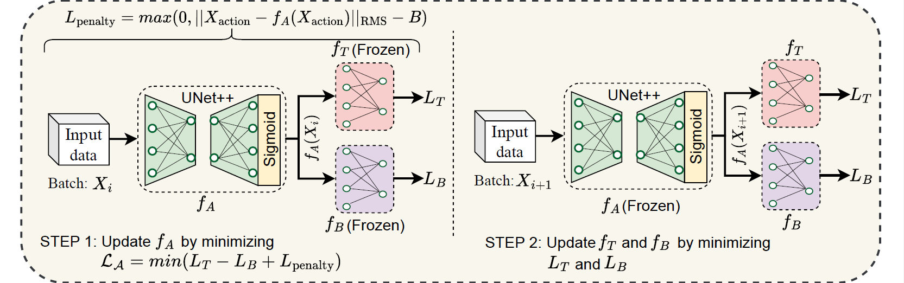

# Balancing Privacy and Action Performance: A Penalty-Driven Approach to Image Anonymization

🧠 This project introduces a **penalty-driven strategy** to balance 🔒 anonymization and 🏃‍♀️ action recognition performance, using custom 🧪 loss functions and 🛠️ two-step training.

---

  
  
  

---

⭐ If you find this work helpful to your research, Don't forget to give a star to this repo. Thanks! 🤗

**"Balancing Privacy and Action Performance: A Penalty-Driven Approach to Image Anonymization."**

## 📄 Abstract

The rapid development of video surveillance systems for object detection, tracking, activity recognition, and anomaly detection has revolutionized our day-to-day lives while setting alarms for privacy concerns. It isn’t easy to strike a balance between visual privacy and action recognition performance in most computer vision models. Is it possible to safeguard privacy without sacrificing performance? It poses a formidable challenge, as even minor privacy enhancements can lead to substantial performance degradation. To address this challenge, we propose a privacy-preserving image anonymization technique that optimizes the anonymizer using penalties from the utility branch, ensuring improved action recognition performance while minimally affecting privacy leakage. This approach addresses the trade-off between minimizing privacy leakage and maintaining high action performance. The proposed approach is primarily designed to align with the regulatory standards of the EU AI Act and GDPR, ensuring the protection of personally identifiable information while maintaining action performance. To the best of our knowledge, we are the first to introduce a feature-based penalty scheme that exclusively controls the action features, allowing freedom to anonymize private attributes. Extensive experiments were conducted to validate the effectiveness of the proposed method. The results demonstrate that applying a penalty to anonymizer from utility branch enhances action performance while maintaining nearly consistent privacy leakage across different penalty settings.

## 🏗️ Project Structure

📦 Balancing Privacy and Action Performance: A Penalty-Driven Approach to Image Anonymization/
├── 📁 privacy_training/                  
├── 📁 action_training/                  
├── 📁 anonymization_training/                
├── 📁 aux_code/                     
├── 📁 fa_pretraining/                 
├── 📄 conda_requirement.txt                 
├── 📄 cv2               
├── 📄 pip_requirements.txt                
├── 📄 readme         
└── 📄 balance.yml                   

### Dataset Setup

[VISPR Page](https://tribhuvanesh.github.io/vpa/)

## 🧩 Proposed Penalty-Driven Framework

## 🖼️ Anonymized Images

### Brush Hair

## 📊 Results

## 📬 Contact

For any inquiries or feedback, feel free to reach out: [naas@create.aau.dk](mailto:naas@create.aau.dk)
